<div align="center">

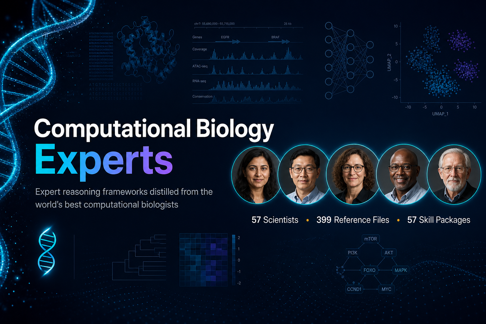

# 🧬 Computational Biology Experts

### A curated atlas of expert reasoning frameworks for 57 landmark computational biologists

*Distilled from primary sources — interviews, lectures, landmark papers, and award speeches*

*Load any scientist's `SKILL.md` into your AI agent to reason like the world's best computational biologists.*

<br/>

[](https://github.com/BioTender-max/computational-biology-experts)
[](https://github.com/BioTender-max/computational-biology-experts)
[](https://github.com/BioTender-max/computational-biology-experts)
[](./LICENSE)

<br/>

**[🖼️ Gallery](#️-the-scientists) · [📋 Directory](#-directory) · [🧭 Usage Guide](#-usage-guide) · [📦 Package Structure](#-package-structure) · [⚗️ Methodology](#️-distillation-methodology)**

</div>

---

## 🖼️ The Scientists

<div align="center">
<sub>Click any portrait to explore their reasoning framework</sub>

<br/>

<table>
  <tr>
    <td align="center" width="200">
      <a href="./david-baker/">
        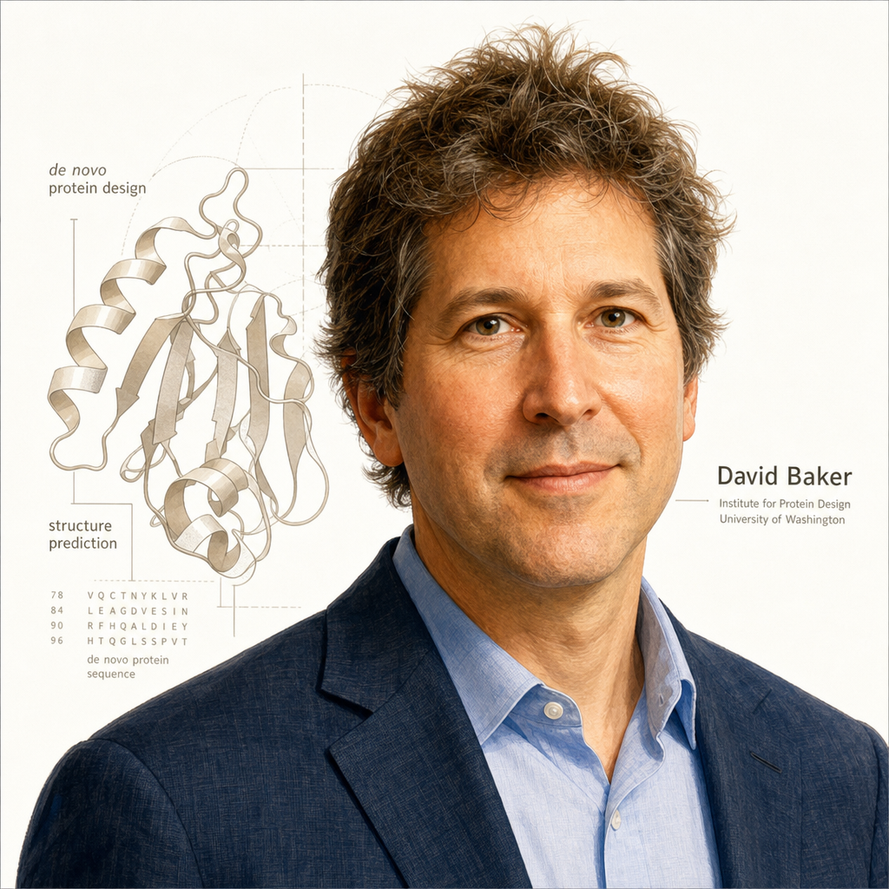<br/>
        <b>David Baker</b><br/>
        <sub>🔬 Protein Design</sub><br/>
        <sub><i>Nobel 2024 · Rosetta · RFDiffusion</i></sub>
      </a>
    </td>
    <td align="center" width="200">
      <a href="./demis-hassabis/">
        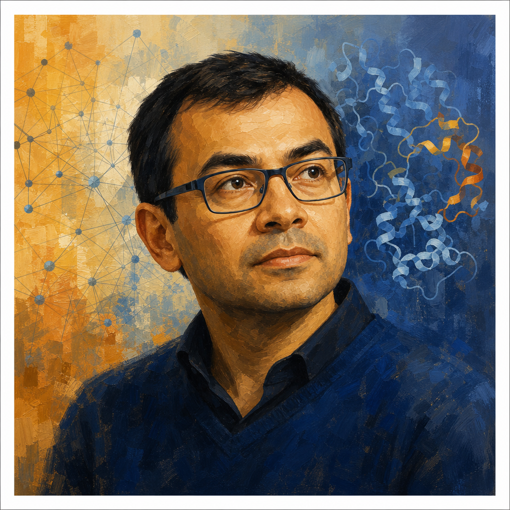<br/>
        <b>Demis Hassabis</b><br/>
        <sub>🔬 AI for Biology</sub><br/>
        <sub><i>Nobel 2024 · AlphaFold · DeepMind</i></sub>
      </a>
    </td>
    <td align="center" width="200">
      <a href="./eugene-myers/">
        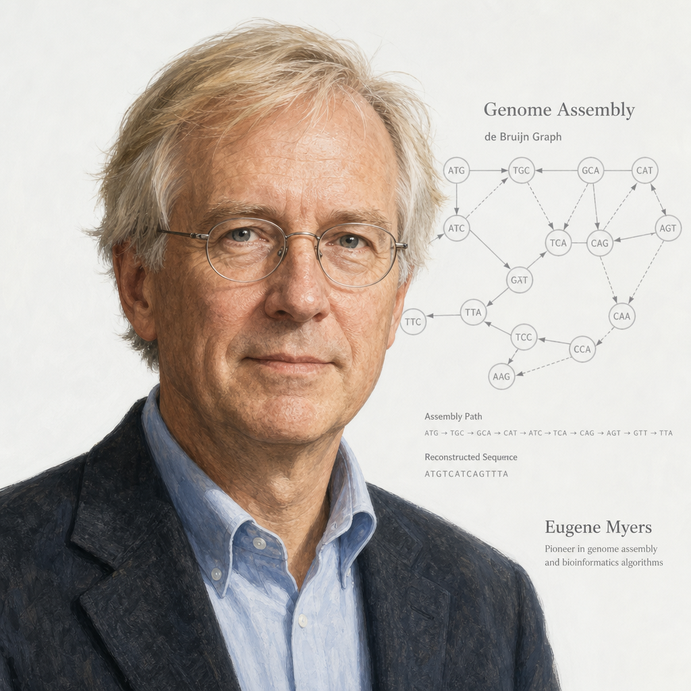<br/>
        <b>Eugene Myers</b><br/>
        <sub>🔬 Genome Assembly</sub><br/>
        <sub><i>Breakthrough Prize · BLAST · WGS</i></sub>
      </a>
    </td>
    <td align="center" width="200">
      <a href="./aviv-regev/">
        <br/>
        <b>Aviv Regev</b><br/>
        <sub>🔬 Single-Cell Genomics</sub><br/>
        <sub><i>Human Cell Atlas · scRNA-seq</i></sub>
      </a>
    </td>
  </tr>
  <tr>
    <td align="center" width="200">
      <a href="./lior-pachter/">
        <br/>
        <b>Lior Pachter</b><br/>
        <sub>🔬 Computational Genomics</sub><br/>
        <sub><i>kallisto · pseudoalignment · sleuth</i></sub>
      </a>
    </td>
    <td align="center" width="200">
      <a href="./bonnie-berger/">
        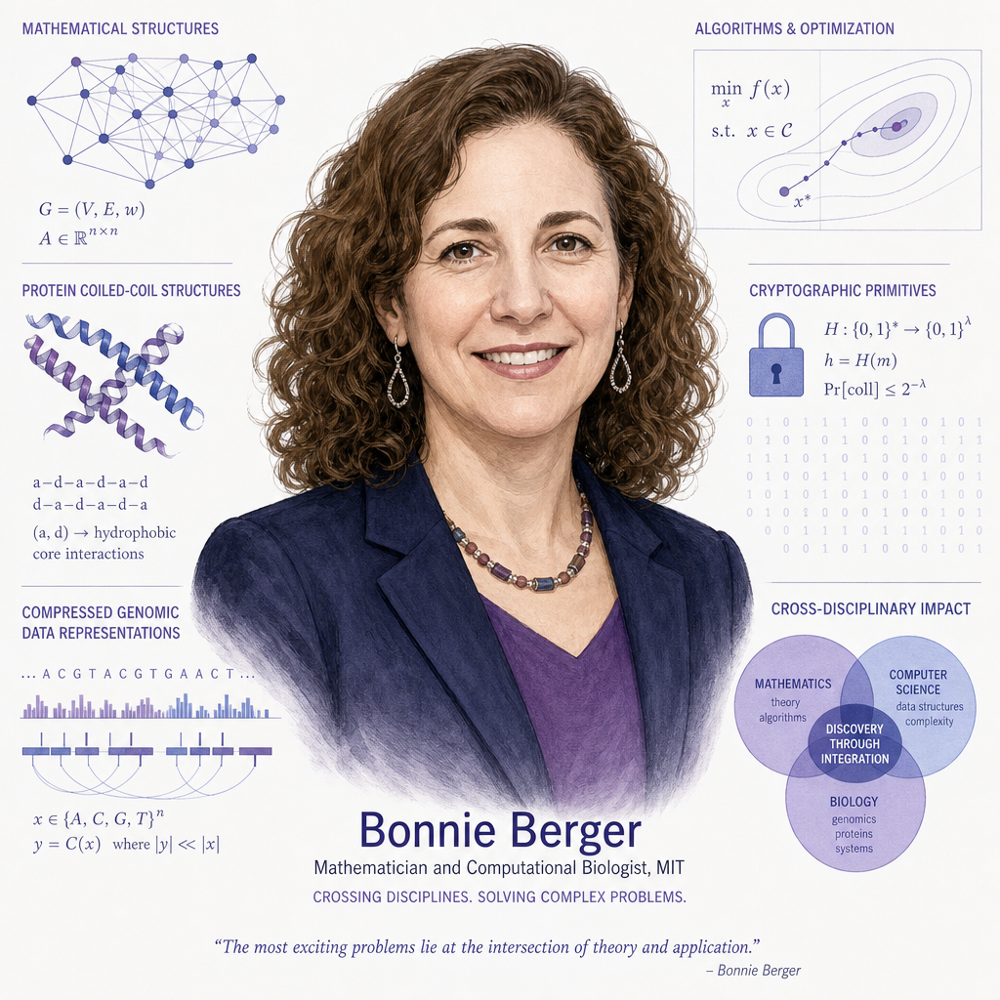<br/>
        <b>Bonnie Berger</b><br/>
        <sub>🔬 Mathematical Biology</sub><br/>
        <sub><i>Compressive genomics · IsoRank</i></sub>
      </a>
    </td>
    <td align="center" width="200">
      <a href="./ewan-birney/">
        <br/>
        <b>Ewan Birney</b><br/>
        <sub>🔬 Genome Annotation</sub><br/>
        <sub><i>Ensembl · ENCODE · GeneWise</i></sub>
      </a>
    </td>
    <td align="center" width="200">
      <a href="./soren-brunak/">
        <br/>
        <b>Søren Brunak</b><br/>
        <sub>🔬 Disease Systems Biology</sub><br/>
        <sub><i>SignalP · disease trajectories · EHR</i></sub>
      </a>
    </td>
  </tr>
  <tr>
    <td align="center" width="200">
      <a href="./christina-leslie/">
        <br/>
        <b>Christina Leslie</b><br/>
        <sub>🔬 ML for Genomics</sub><br/>
        <sub><i>String kernels · GraphReg</i></sub>
      </a>
    </td>
    <td align="center" width="200">
      <a href="./bernhard-scholkopf/">
        <br/>
        <b>Bernhard Schölkopf</b><br/>
        <sub>🔬 Causal ML</sub><br/>
        <sub><i>SVMs · kernel methods · causality</i></sub>
      </a>
    </td>
    <td align="center" width="200">
      <a href="./dana-peer/">
        <br/>
        <b>Dana Pe'er</b><br/>
        <sub>🔬 Single-Cell / Cancer</sub><br/>
        <sub><i>Palantir · MAGIC · Wanderlust</i></sub>
      </a>
    </td>
    <td align="center" width="200">
      <a href="./manolis-kellis/">
        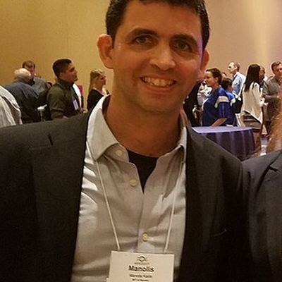<br/>
        <b>Manolis Kellis</b><br/>
        <sub>🔬 Comparative Genomics</sub><br/>
        <sub><i>ChromHMM · ENCODE · Alzheimer's</i></sub>
      </a>
    </td>
  </tr>
  <tr>
    <td align="center" width="200">
      <a href="./eran-segal/">
        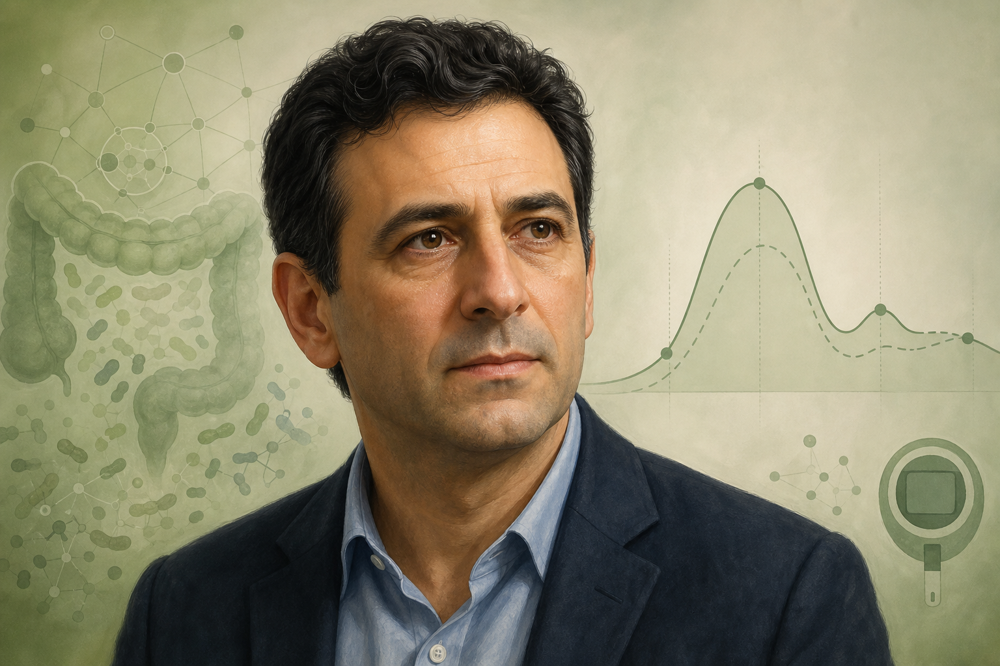<br/>
        <b>Eran Segal</b><br/>
        <sub>🔬 Personalized Medicine</sub><br/>
        <sub><i>Personalized nutrition · microbiome</i></sub>
      </a>
    </td>
    <td align="center" width="200">
      <a href="./daphne-koller/">
        <br/>
        <b>Daphne Koller</b><br/>
        <sub>🔬 Probabilistic AI / Drug Discovery</sub><br/>
        <sub><i>PGMs · Coursera · insitro · MacArthur Fellow</i></sub>
      </a>
    </td>
    <td align="center" width="200">
      <a href="./richard-durbin/">
        <br/>
        <b>Richard Durbin</b><br/>
        <sub>🔬 Population Genomics</sub><br/>
        <sub><i>BWA · GATK · 1000 Genomes</i></sub>
      </a>
    </td>
    <td align="center" width="200">
      <a href="./heng-li/">
        <br/>
        <b>Heng Li</b><br/>
        <sub>🔬 Sequence Alignment</sub><br/>
        <sub><i>BWA · SAMtools · minimap2</i></sub>
      </a>
    </td>
  </tr>
  <tr>
    <td align="center" width="200">
      <a href="./sean-eddy/">
        <br/>
        <b>Sean Eddy</b><br/>
        <sub>🔬 Sequence Analysis</sub><br/>
        <sub><i>HMMER · Rfam · Infernal</i></sub>
      </a>
    </td>
    <td align="center" width="200">
      <a href="./pavel-pevzner/">
        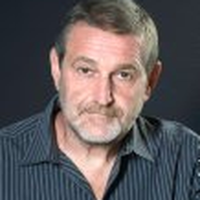<br/>
        <b>Pavel Pevzner</b><br/>
        <sub>🔬 Genome Assembly</sub><br/>
        <sub><i>SPAdes · de Bruijn graphs</i></sub>
      </a>
    </td>
    <td align="center" width="200">
      <a href="./steven-salzberg/">
        <br/>
        <b>Steven Salzberg</b><br/>
        <sub>🔬 Genome Annotation</sub><br/>
        <sub><i>HISAT2 · StringTie · CHESS</i></sub>
      </a>
    </td>
    <td align="center" width="200">
      <a href="./michael-schatz/">
        <br/>
        <b>Michael Schatz</b><br/>
        <sub>🔬 Genome Assembly</sub><br/>
        <sub><i>MUMmer · long-read assembly</i></sub>
      </a>
    </td>
  </tr>
  <tr>
    <td align="center" width="200">
      <a href="./jared-simpson/">
        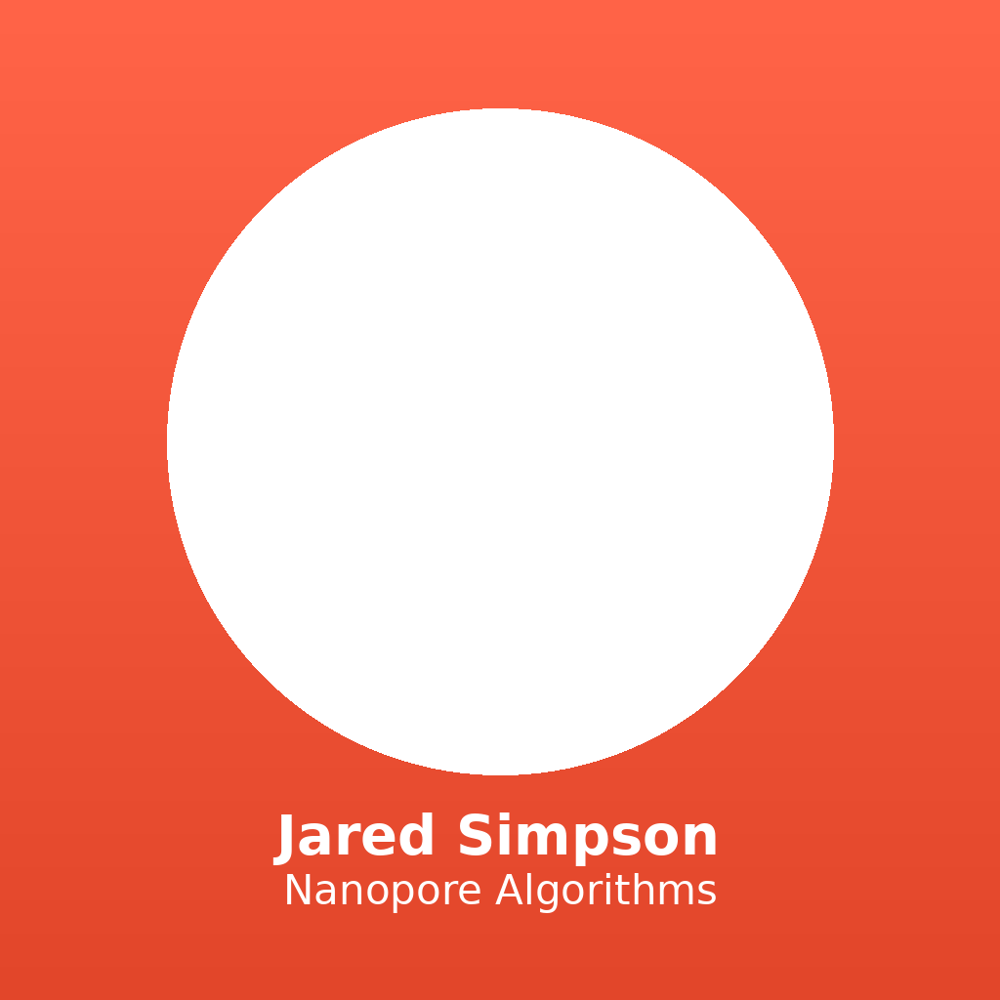<br/>
        <b>Jared Simpson</b><br/>
        <sub>🔬 Nanopore Genomics</sub><br/>
        <sub><i>nanopolish · ABySS · f5c</i></sub>
      </a>
    </td>
    <td align="center" width="200">
      <a href="./john-novembre/">
        <br/>
        <b>John Novembre</b><br/>
        <sub>🔬 Population Genetics</sub><br/>
        <sub><i>STRUCTURE · ADMIXTURE · POPRES</i></sub>
      </a>
    </td>
    <td align="center" width="200">
      <a href="./jonathan-pritchard/">
        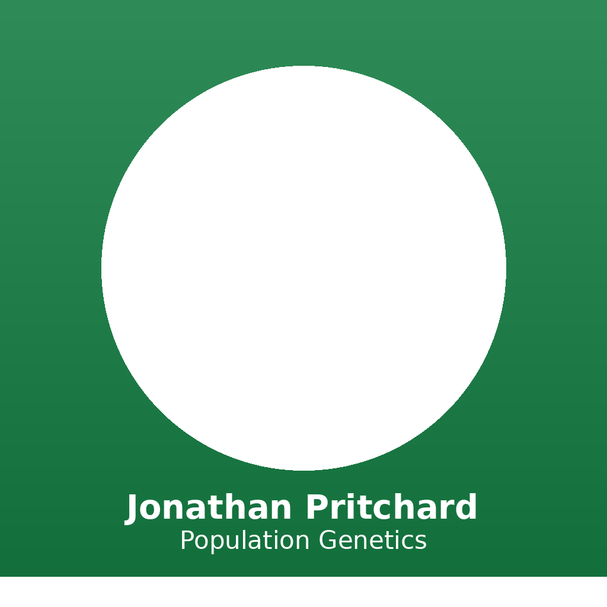<br/>
        <b>Jonathan Pritchard</b><br/>
        <sub>🔬 Human Genetics</sub><br/>
        <sub><i>STRUCTURE · polygenic adaptation</i></sub>
      </a>
    </td>
    <td align="center" width="200">
      <a href="./alkes-price/">
        <br/>
        <b>Alkes Price</b><br/>
        <sub>🔬 Statistical Genetics</sub><br/>
        <sub><i>EIGENSTRAT · LD Score regression</i></sub>
      </a>
    </td>
  </tr>
  <tr>
    <td align="center" width="200">
      <a href="./nir-friedman/">
        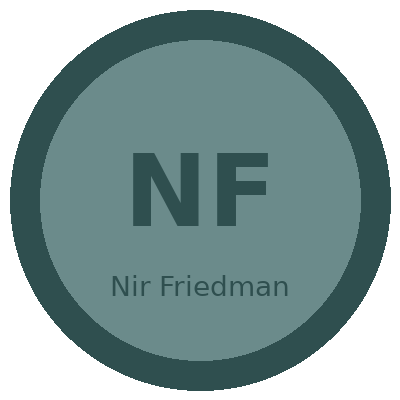<br/>
        <b>Nir Friedman</b><br/>
        <sub>🔬 Probabilistic Genomics</sub><br/>
        <sub><i>Bayesian networks · scRNA-seq</i></sub>
      </a>
    </td>
    <td align="center" width="200">
      <a href="./albert-laszlo-barabasi/">
        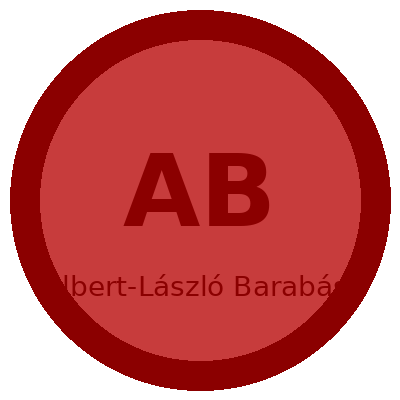<br/>
        <b>Albert-László Barabási</b><br/>
        <sub>🔬 Network Science</sub><br/>
        <sub><i>Scale-free networks · interactome</i></sub>
      </a>
    </td>
    <td align="center" width="200">
      <a href="./trey-ideker/">
        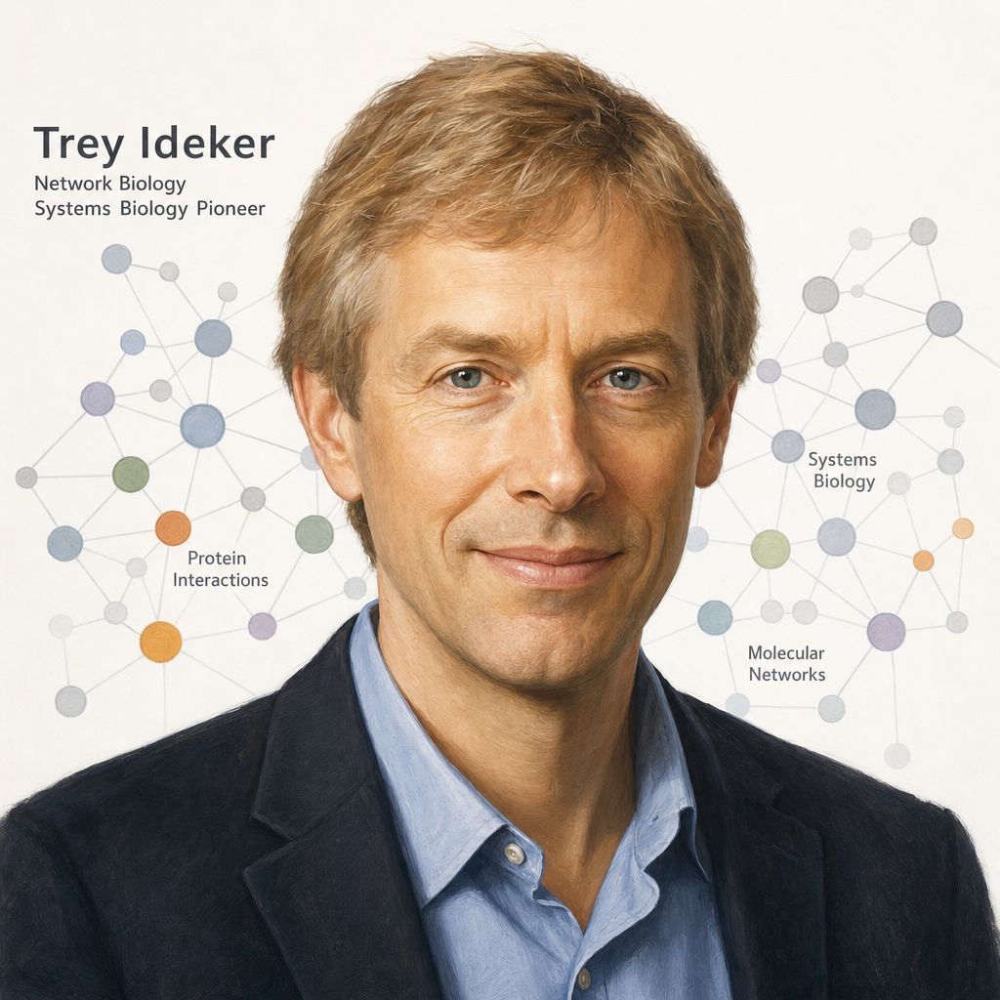<br/>
        <b>Trey Ideker</b><br/>
        <sub>🔬 Systems Biology</sub><br/>
        <sub><i>Cytoscape · DCell · network medicine</i></sub>
      </a>
    </td>
    <td align="center" width="200">
      <a href="./fabian-theis/">
        <br/>
        <b>Fabian Theis</b><br/>
        <sub>🔬 Computational Biology</sub><br/>
        <sub><i>scVI · scANVI · CellRank · SCANPY</i></sub>
      </a>
    </td>
  </tr>
  <tr>
    <td align="center" width="200">
      <a href="./rahul-satija/">
        <br/>
        <b>Rahul Satija</b><br/>
        <sub>🔬 Single-Cell Genomics</sub><br/>
        <sub><i>Seurat · WNN · SCTransform · Azimuth</i></sub>
      </a>
    </td>
    <td align="center" width="200">
      <a href="./sarah-teichmann/">
        <br/>
        <b>Sarah Teichmann</b><br/>
        <sub>🔬 Single-Cell Genomics</sub><br/>
        <sub><i>Human Cell Atlas · cell2location</i></sub>
      </a>
    </td>
    <td align="center" width="200">
      <a href="./cole-trapnell/">
        <br/>
        <b>Cole Trapnell</b><br/>
        <sub>🔬 Single-Cell Genomics</sub><br/>
        <sub><i>Monocle · sci-RNA-seq · TopHat</i></sub>
      </a>
    </td>
    <td align="center" width="200">
      <a href="./peter-kharchenko/">
        <br/>
        <b>Peter Kharchenko</b><br/>
        <sub>🔬 Single-Cell Methods</sub><br/>
        <sub><i>SCDE · velocyto · Numbat · Baysor</i></sub>
      </a>
    </td>
  </tr>
  <tr>
    <td align="center" width="200">
      <a href="./bing-ren/">
        <br/>
        <b>Bing Ren</b><br/>
        <sub>🔬 Epigenomics</sub><br/>
        <sub><i>ChIP-seq · ATAC-seq · Hi-C · ABC model</i></sub>
      </a>
    </td>
    <td align="center" width="200">
      <a href="./rob-knight/">
        <br/>
        <b>Rob Knight</b><br/>
        <sub>🔬 Microbiome</sub><br/>
        <sub><i>QIIME2 · UniFrac · Earth Microbiome</i></sub>
      </a>
    </td>
    <td align="center" width="200">
      <a href="./curtis-huttenhower/">
        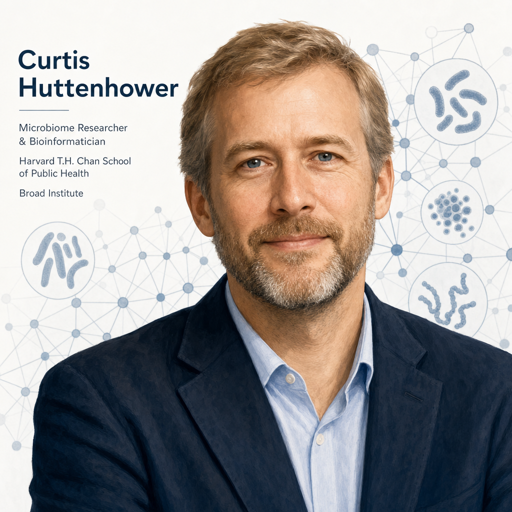<br/>
        <b>Curtis Huttenhower</b><br/>
        <sub>🔬 Microbiome</sub><br/>
        <sub><i>MetaPhlAn · HUMAnN · bioBakery</i></sub>
      </a>
    </td>
    <td align="center" width="200">
      <a href="./peer-bork/">
        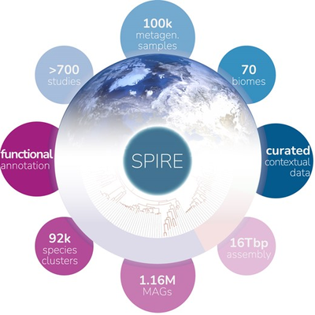<br/>
        <b>Peer Bork †</b><br/>
        <sub>🔬 Metagenomics</sub><br/>
        <sub><i>STRING · iTOL · SMART · enterotypes</i></sub>
      </a>
    </td>
  </tr>
  <tr>
    <td align="center" width="200">
      <a href="./martin-steinegger/">
        <br/>
        <b>Martin Steinegger</b><br/>
        <sub>🔬 Sequence Analysis</sub><br/>
        <sub><i>MMseqs2 · ColabFold · Foldseek</i></sub>
      </a>
    </td>
    <td align="center" width="200">
      <a href="./andrej-sali/">
        <br/>
        <b>Andrej Sali</b><br/>
        <sub>🔬 Structural Biology</sub><br/>
        <sub><i>MODELLER · IMP · Nuclear Pore Complex</i></sub>
      </a>
    </td>
    <td align="center" width="200">
      <a href="./brian-shoichet/">
        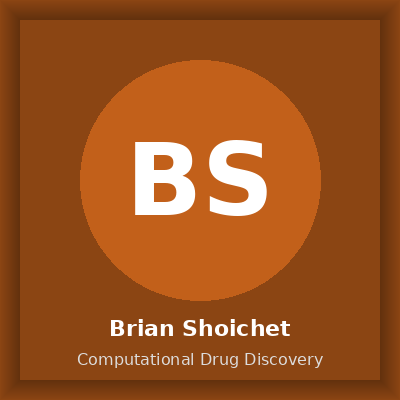<br/>
        <b>Brian Shoichet</b><br/>
        <sub>🔬 Drug Discovery</sub><br/>
        <sub><i>Ultra-large docking · colloidal aggregation</i></sub>
      </a>
    </td>
    <td align="center" width="200">
      <a href="./ron-dror/">
        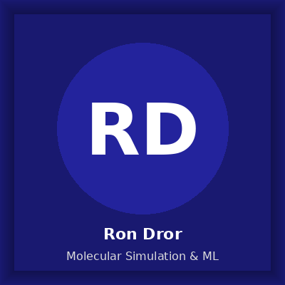<br/>
        <b>Ron Dror</b><br/>
        <sub>🔬 Molecular Simulation</sub><br/>
        <sub><i>Anton · GPCR mechanisms · MD + ML</i></sub>
      </a>
    </td>
  </tr>
  <tr>
    <td align="center" width="200">
      <a href="./stein-aerts/">
        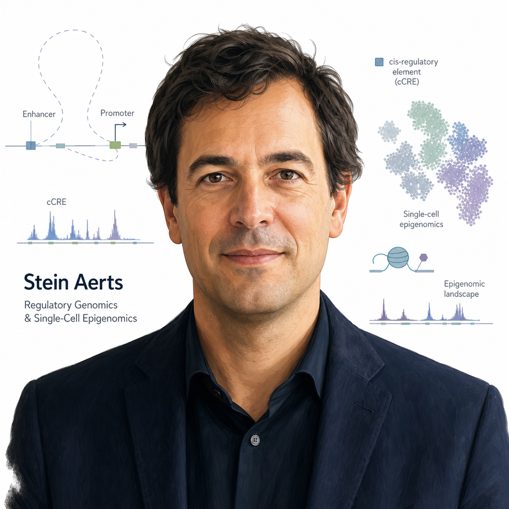<br/>
        <b>Stein Aerts</b><br/>
        <sub>🔬 Regulatory Genomics</sub><br/>
        <sub><i>SCENIC · cisTopic · CREsted</i></sub>
      </a>
    </td>
    <td align="center" width="200">
      <a href="./barbara-engelhardt/">
        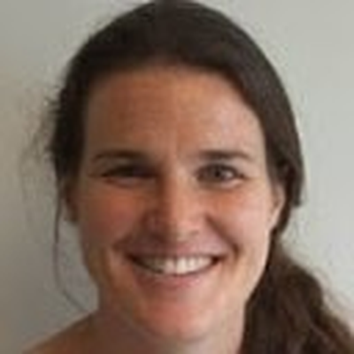<br/>
        <b>Barbara Engelhardt</b><br/>
        <sub>🔬 Probabilistic ML</sub><br/>
        <sub><i>PEER · GTEx · GPLVM · ISCB Overton 2021</i></sub>
      </a>
    </td>
    <td align="center" width="200">
      <a href="./anshul-kundaje/">
        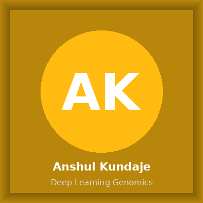<br/>
        <b>Anshul Kundaje</b><br/>
        <sub>🔬 Regulatory Genomics</sub><br/>
        <sub><i>BPNet · ChromBPNet · TF-MoDISco · ENCODE</i></sub>
      </a>
    </td>
    <td align="center" width="200">
      <a href="./ben-raphael/">
        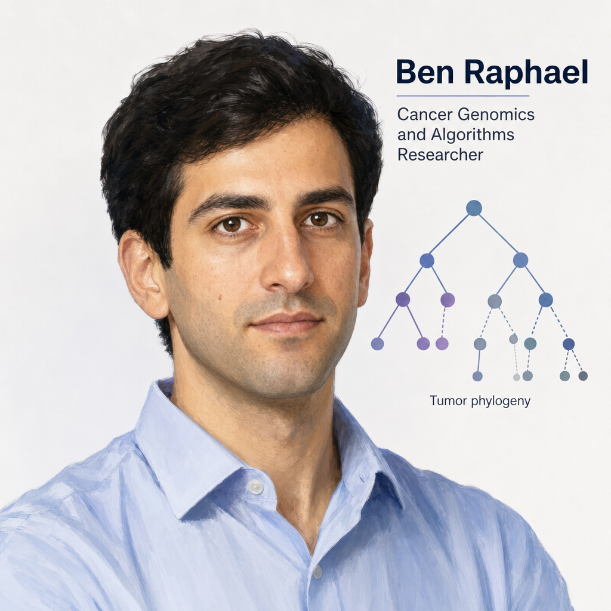<br/>
        <b>Ben Raphael</b><br/>
        <sub>🔬 Cancer Genomics</sub><br/>
        <sub><i>HATCHet · THetA · TCGA · ISCB Innovator 2021</i></sub>
      </a>
    </td>
  </tr>
  <tr>
    <td align="center" width="200">
      <a href="./gad-getz/">
        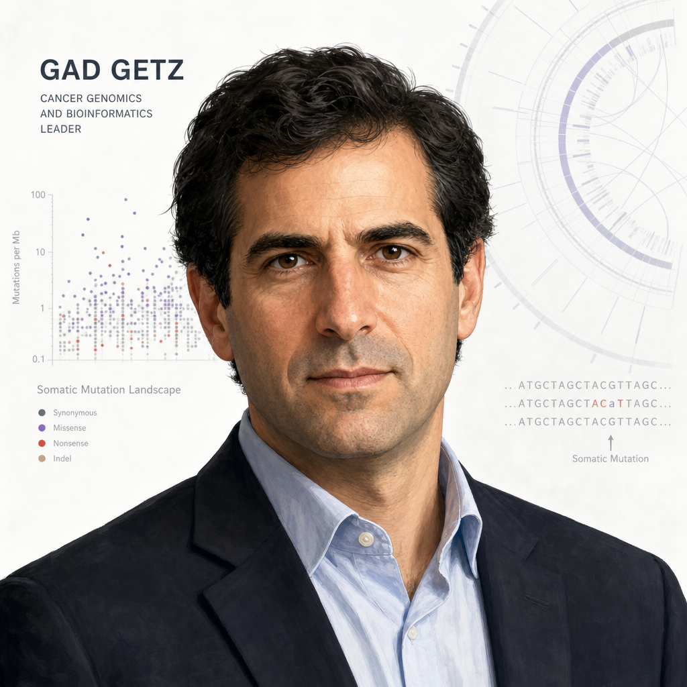<br/>
        <b>Gad Getz</b><br/>
        <sub>🔬 Cancer Genomics</sub><br/>
        <sub><i>MutSig · MuTect · GISTIC · TCGA GDAC</i></sub>
      </a>
    </td>
    <td align="center" width="200">
      <a href="./li-ding/">
        <br/>
        <b>Li Ding</b><br/>
        <sub>🔬 Cancer Proteogenomics</sub><br/>
        <sub><i>First cancer genome · TCGA · CPTAC</i></sub>
      </a>
    </td>
    <td align="center" width="200">
      <a href="./gunnar-ratsch/">
        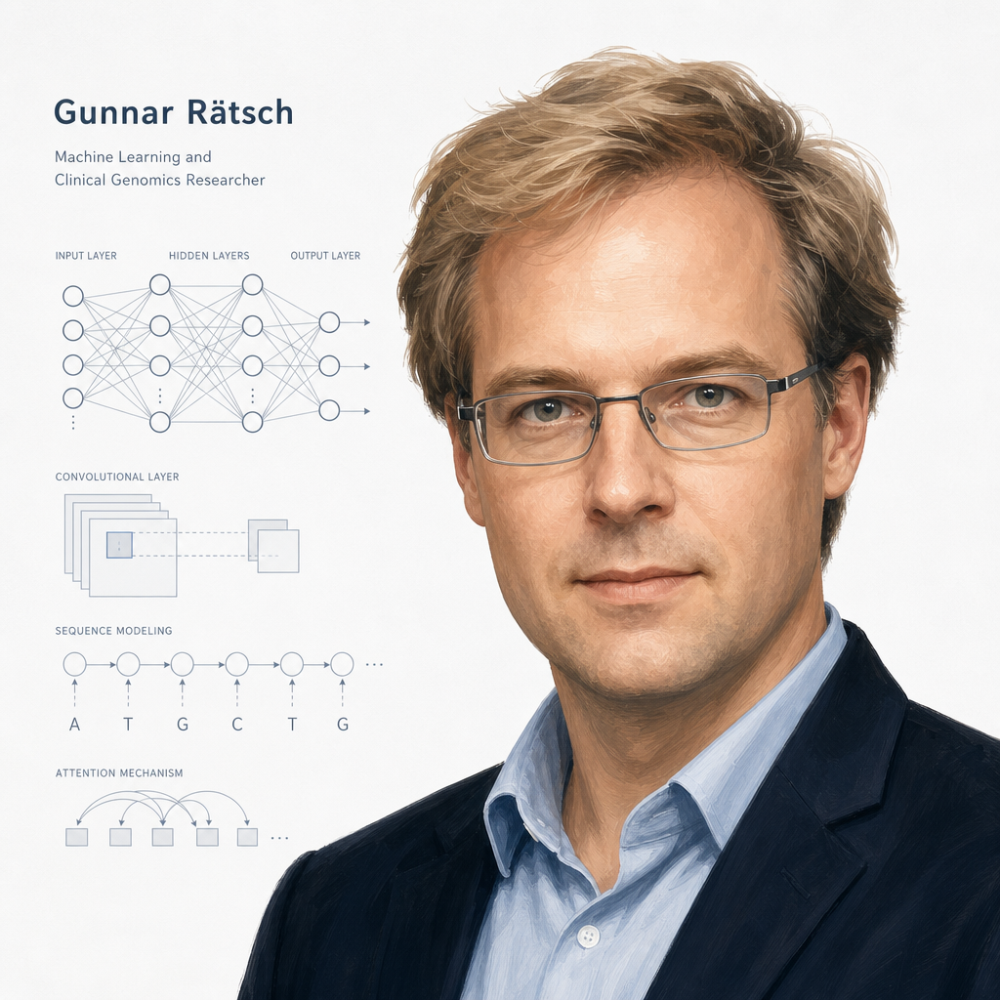<br/>
        <b>Gunnar Rätsch</b><br/>
        <sub>🔬 ML for Medicine</sub><br/>
        <sub><i>Tumor Profiler · deep learning pathology</i></sub>
      </a>
    </td>
    <td align="center" width="200">
      <a href="./jure-leskovec/">
        <br/>
        <b>Jure Leskovec</b><br/>
        <sub>🔬 Graph Neural Networks</sub><br/>
        <sub><i>PyG · GraphSAGE · Decagon · TDC</i></sub>
      </a>
    </td>
  </tr>
  <tr>
    <td align="center" width="200">
      <a href="./olga-troyanskaya/">
        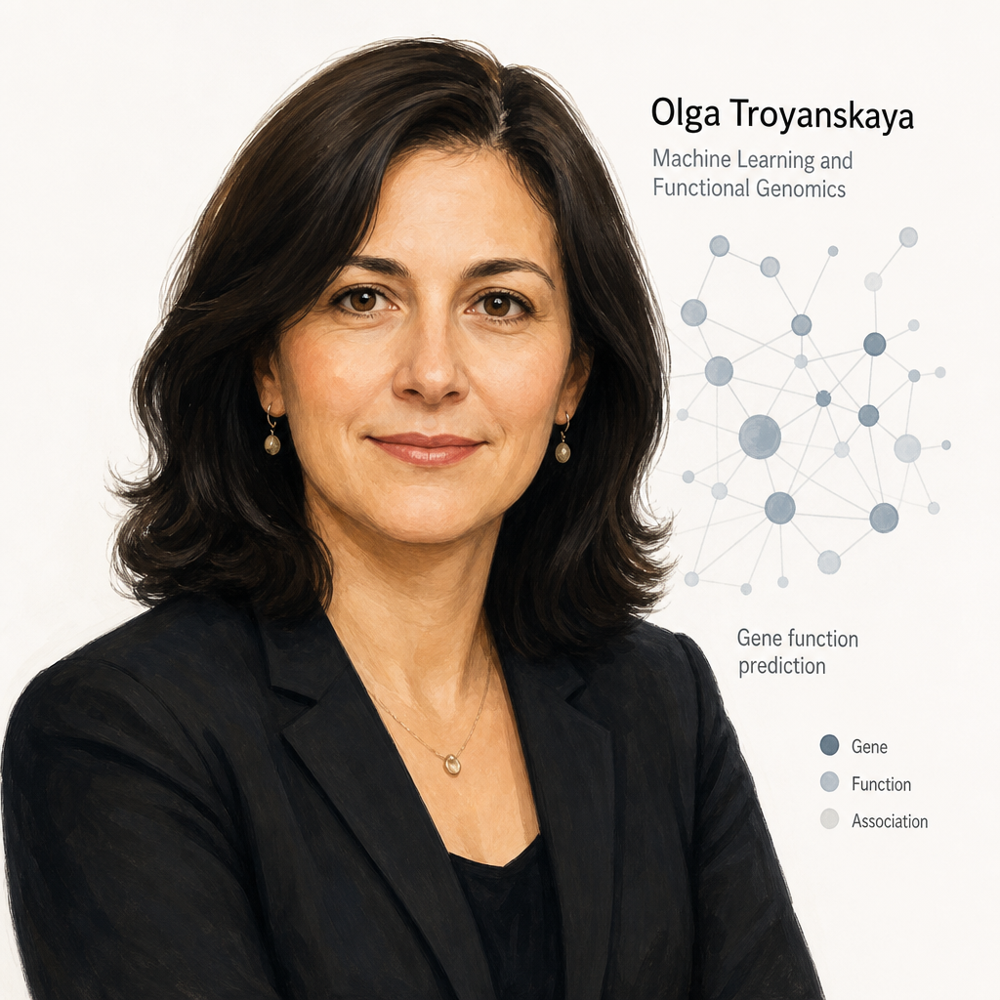<br/>
        <b>Olga Troyanskaya</b><br/>
        <sub>🔬 Genomic Integration</sub><br/>
        <sub><i>DeepSEA · Sei · Bayesian integration</i></sub>
      </a>
    </td>
    <td align="center" width="200">
      <a href="./wouter-meuleman/">
        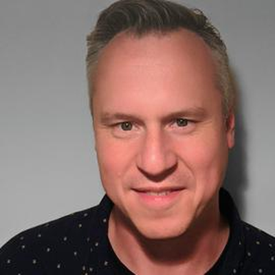<br/>
        <b>Wouter Meuleman</b><br/>
        <sub>🔬 Regulatory Genomics</sub><br/>
        <sub><i>DHS Index · DNA-Diffusion · augmented genomics</i></sub>
      </a>
    </td>
    <td align="center" width="200">
      <a href="./yun-song/">
        <br/>
        <b>Yun Song</b><br/>
        <sub>🔬 Probabilistic Genomics</sub><br/>
        <sub><i>Coalescent theory · probabilistic models</i></sub>
      </a>
    </td>
    <td align="center" width="200">
      <a href="./elhanan-borenstein/">
        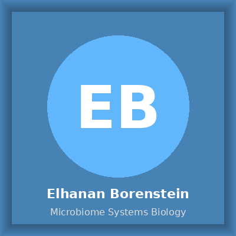<br/>
        <b>Elhanan Borenstein</b><br/>
        <sub>🔬 Microbiome Systems</sub><br/>
        <sub><i>Metabolic modeling · multi-omics microbiome</i></sub>
      </a>
    </td>
  </tr>
  <tr>
    <td align="center" width="200">
      <a href="./david-haussler/">
        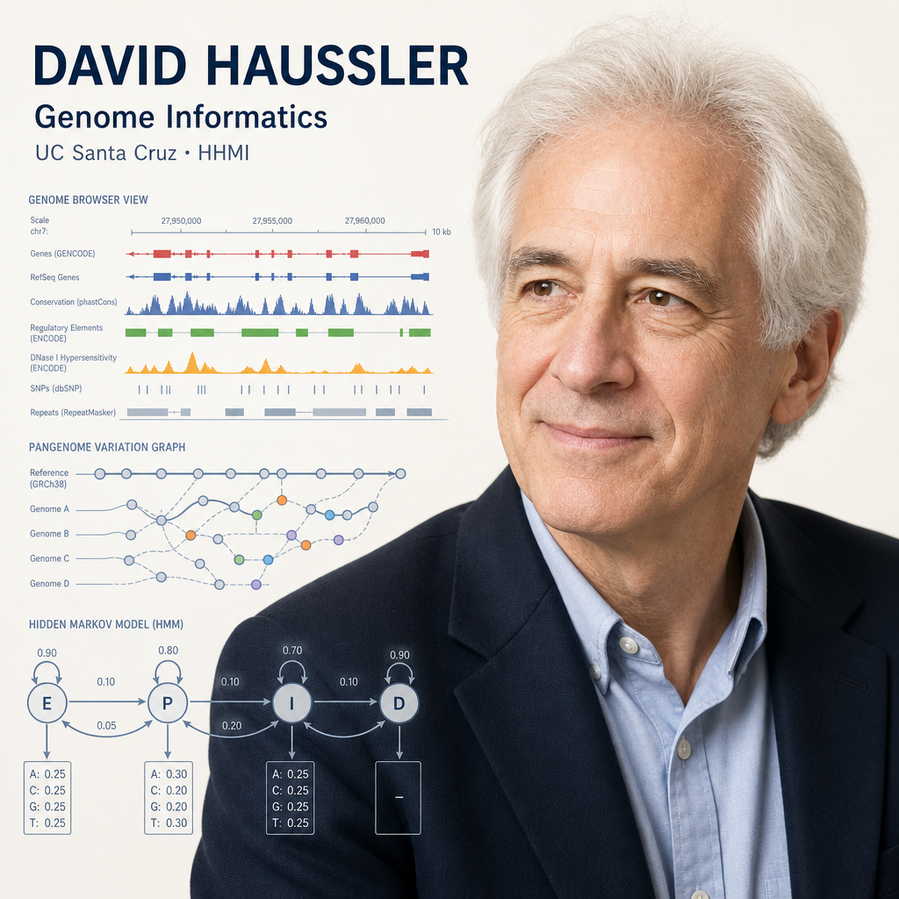<br/>
        <b>David Haussler</b><br/>
        <sub>🔬 Genome Informatics</sub><br/>
        <sub><i>UCSC Browser · Pangenome · HMMs</i></sub>
      </a>
    </td>
    <td align="center" width="200">
      <a href="./chris-sander/">
        <br/>
        <b>Chris Sander</b><br/>
        <sub>🔬 Cancer Systems Biology</sub><br/>
        <sub><i>cBioPortal · DSSP · co-evolution</i></sub>
      </a>
    </td>
    <td align="center" width="200">
      <a href="./nuria-lopez-bigas/">
        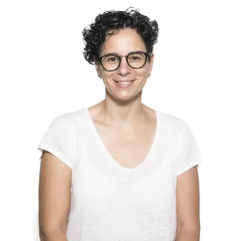<br/>
        <b>Núria López-Bigas</b><br/>
        <sub>🔬 Cancer Genomics</sub><br/>
        <sub><i>IntOGen · BoostDM · driver mutations</i></sub>
      </a>
    </td>
    <td align="center" width="200">
      <a href="./james-zou/">
        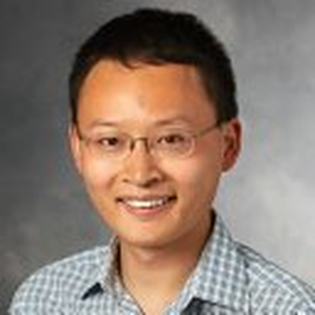<br/>
        <b>James Zou</b><br/>
        <sub>🔬 AI for Biomedicine</sub><br/>
        <sub><i>SHAP · EchoNet · Virtual Lab</i></sub>
      </a>
    </td>
  </tr>
  <tr>
    <td align="center" width="200">
      <a href="./amos-bairoch/">
        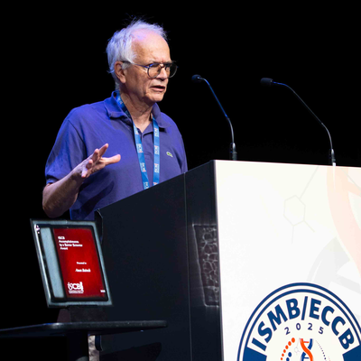<br/>
        <b>Amos Bairoch</b><br/>
        <sub>🔬 Biocuration</sub><br/>
        <sub><i>Swiss-Prot · UniProt · ExPASy</i></sub>
      </a>
    </td>
    <td width="200"></td>
    <td width="200"></td>
    <td width="200"></td>
  </tr>
</table>

</div>

---

## 📋 Directory

<sub>57 scientists · sorted A → Z by last name</sub>

| Scientist | Domain | Institution | Landmark Contributions | Package |
|-----------|--------|-------------|------------------------|---------|
| [Stein Aerts](./stein-aerts/) |  | KU Leuven / VIB.AI | SCENIC · cisTopic · CREsted | [→](./stein-aerts/SKILL.md) |
| [Amos Bairoch](./amos-bairoch/) |  | SIB Geneva | ISCB 2025 · Swiss-Prot · UniProt | [→](./amos-bairoch/SKILL.md) |
| [David Baker](./david-baker/) |  | UW / HHMI | Nobel 2024 · Rosetta · RFDiffusion | [→](./david-baker/SKILL.md) |
| [Albert-László Barabási](./albert-laszlo-barabasi/) |  | Northeastern / CEU | Scale-free networks · interactome | [→](./albert-laszlo-barabasi/SKILL.md) |
| [Bonnie Berger](./bonnie-berger/) |  | MIT | Compressive genomics · IsoRank | [→](./bonnie-berger/SKILL.md) |
| [Ewan Birney](./ewan-birney/) |  | EMBL-EBI | Ensembl · ENCODE · GeneWise | [→](./ewan-birney/SKILL.md) |
| [Elhanan Borenstein](./elhanan-borenstein/) |  | Tel Aviv University | Metabolic modeling · multi-omics microbiome | [→](./elhanan-borenstein/SKILL.md) |
| [Peer Bork †](./peer-bork/) |  | EMBL Heidelberg | STRING · iTOL · SMART · enterotypes | [→](./peer-bork/SKILL.md) |
| [Søren Brunak](./soren-brunak/) |  | DTU / NNF | SignalP · disease trajectories · EHR | [→](./soren-brunak/SKILL.md) |
| [Li Ding](./li-ding/) |  | WashU | First cancer genome · TCGA · CPTAC | [→](./li-ding/SKILL.md) |
| [Ron Dror](./ron-dror/) |  | Stanford | Anton · GPCR mechanisms · MD + ML | [→](./ron-dror/SKILL.md) |
| [Richard Durbin](./richard-durbin/) |  | Cambridge / Sanger | BWA · GATK · 1000 Genomes | [→](./richard-durbin/SKILL.md) |
| [Sean Eddy](./sean-eddy/) |  | Harvard / HHMI | HMMER · Rfam · Infernal | [→](./sean-eddy/SKILL.md) |
| [Barbara Engelhardt](./barbara-engelhardt/) |  | Stanford / Gladstone | PEER · GTEx · GPLVM · ISCB Overton 2021 | [→](./barbara-engelhardt/SKILL.md) |
| [Nir Friedman](./nir-friedman/) |  | Hebrew University | Bayesian networks · scRNA-seq | [→](./nir-friedman/SKILL.md) |
| [Gad Getz](./gad-getz/) |  | Broad / MGH | MutSig · MuTect · GISTIC · TCGA GDAC | [→](./gad-getz/SKILL.md) |
| [Demis Hassabis](./demis-hassabis/) |  | DeepMind / Google | Nobel 2024 · AlphaFold · DeepMind | [→](./demis-hassabis/SKILL.md) |
| [David Haussler](./david-haussler/) |  | UCSC / HHMI | ISCB 2008 · UCSC Browser · Pangenome | [→](./david-haussler/SKILL.md) |
| [Curtis Huttenhower](./curtis-huttenhower/) |  | Harvard SPH | MetaPhlAn · HUMAnN · bioBakery | [→](./curtis-huttenhower/SKILL.md) |
| [Trey Ideker](./trey-ideker/) |  | UCSD | Cytoscape · DCell · network medicine | [→](./trey-ideker/SKILL.md) |
| [Manolis Kellis](./manolis-kellis/) |  | MIT / HHMI | ChromHMM · ENCODE · Alzheimer's | [→](./manolis-kellis/SKILL.md) |
| [Peter Kharchenko](./peter-kharchenko/) |  | Altos Labs | SCDE · velocyto · Numbat · Baysor | [→](./peter-kharchenko/SKILL.md) |
| [Rob Knight](./rob-knight/) |  | UCSD | QIIME2 · UniFrac · Earth Microbiome | [→](./rob-knight/SKILL.md) |
| [Daphne Koller](./daphne-koller/) |  | insitro / Stanford | PGMs · Coursera · insitro · MacArthur Fellow | [→](./daphne-koller/SKILL.md) |
| [Anshul Kundaje](./anshul-kundaje/) |  | Stanford | BPNet · ChromBPNet · TF-MoDISco · ENCODE | [→](./anshul-kundaje/SKILL.md) |
| [Jure Leskovec](./jure-leskovec/) |  | Stanford | PyG · GraphSAGE · Decagon · TDC | [→](./jure-leskovec/SKILL.md) |
| [Christina Leslie](./christina-leslie/) |  | MSKCC | String kernels · GraphReg | [→](./christina-leslie/SKILL.md) |
| [Heng Li](./heng-li/) |  | Dana-Farber / Harvard | BWA · SAMtools · minimap2 | [→](./heng-li/SKILL.md) |
| [Núria López-Bigas](./nuria-lopez-bigas/) |  | IRB Barcelona | ISCB 2022 · IntOGen · BoostDM | [→](./nuria-lopez-bigas/SKILL.md) |
| [Wouter Meuleman](./wouter-meuleman/) |  | Altius Institute | DHS Index · DNA-Diffusion · augmented genomics | [→](./wouter-meuleman/SKILL.md) |
| [Eugene Myers](./eugene-myers/) |  | MPI-CBG | Breakthrough Prize · BLAST · WGS | [→](./eugene-myers/SKILL.md) |
| [John Novembre](./john-novembre/) |  | U Chicago | STRUCTURE · ADMIXTURE · POPRES | [→](./john-novembre/SKILL.md) |
| [Lior Pachter](./lior-pachter/) |  | Caltech | kallisto · pseudoalignment · sleuth | [→](./lior-pachter/SKILL.md) |
| [Dana Pe'er](./dana-peer/) |  | MSKCC / HHMI | Palantir · MAGIC · Wanderlust | [→](./dana-peer/SKILL.md) |
| [Pavel Pevzner](./pavel-pevzner/) |  | UCSD | SPAdes · de Bruijn graphs | [→](./pavel-pevzner/SKILL.md) |
| [Alkes Price](./alkes-price/) |  | Harvard SPH | EIGENSTRAT · LD Score regression | [→](./alkes-price/SKILL.md) |
| [Jonathan Pritchard](./jonathan-pritchard/) |  | Stanford / HHMI | STRUCTURE · polygenic adaptation | [→](./jonathan-pritchard/SKILL.md) |
| [Ben Raphael](./ben-raphael/) |  | Princeton | HATCHet · THetA · TCGA · ISCB Innovator 2021 | [→](./ben-raphael/SKILL.md) |
| [Gunnar Rätsch](./gunnar-ratsch/) |  | ETH Zurich | Tumor Profiler · deep learning pathology | [→](./gunnar-ratsch/SKILL.md) |
| [Aviv Regev](./aviv-regev/) |  | Genentech / MIT | Human Cell Atlas · scRNA-seq | [→](./aviv-regev/SKILL.md) |
| [Bing Ren](./bing-ren/) |  | NYGC / Columbia | ChIP-seq · ATAC-seq · Hi-C · ABC model | [→](./bing-ren/SKILL.md) |
| [Andrej Sali](./andrej-sali/) |  | UCSF | MODELLER · IMP · Nuclear Pore Complex | [→](./andrej-sali/SKILL.md) |
| [Steven Salzberg](./steven-salzberg/) |  | Johns Hopkins | HISAT2 · StringTie · CHESS | [→](./steven-salzberg/SKILL.md) |
| [Chris Sander](./chris-sander/) |  | Dana-Farber / Harvard | ISCB 2010 · cBioPortal · DSSP | [→](./chris-sander/SKILL.md) |
| [Rahul Satija](./rahul-satija/) |  | NYU / NYGC | Seurat · WNN · SCTransform · Azimuth | [→](./rahul-satija/SKILL.md) |
| [Michael Schatz](./michael-schatz/) |  | Johns Hopkins | MUMmer · long-read assembly | [→](./michael-schatz/SKILL.md) |
| [Bernhard Schölkopf](./bernhard-scholkopf/) |  | Max Planck / ELLIS | SVMs · kernel methods · causality | [→](./bernhard-scholkopf/SKILL.md) |
| [Eran Segal](./eran-segal/) |  | Weizmann | Personalized nutrition · microbiome | [→](./eran-segal/SKILL.md) |
| [Brian Shoichet](./brian-shoichet/) |  | UCSF | Ultra-large docking · colloidal aggregation | [→](./brian-shoichet/SKILL.md) |
| [Jared Simpson](./jared-simpson/) |  | OICR / Toronto | nanopolish · ABySS · f5c | [→](./jared-simpson/SKILL.md) |
| [Yun Song](./yun-song/) |  | UC Berkeley | Coalescent theory · probabilistic models | [→](./yun-song/SKILL.md) |
| [Martin Steinegger](./martin-steinegger/) |  | Seoul National U | MMseqs2 · ColabFold · Foldseek | [→](./martin-steinegger/SKILL.md) |
| [Sarah Teichmann](./sarah-teichmann/) |  | Cambridge / Sanger / GSK | Human Cell Atlas · cell2location | [→](./sarah-teichmann/SKILL.md) |
| [Fabian Theis](./fabian-theis/) |  | Helmholtz / TU Munich | scVI · scANVI · CellRank · SCANPY | [→](./fabian-theis/SKILL.md) |
| [Cole Trapnell](./cole-trapnell/) |  | U Washington | Monocle · sci-RNA-seq · TopHat | [→](./cole-trapnell/SKILL.md) |
| [Olga Troyanskaya](./olga-troyanskaya/) |  | Princeton / Flatiron | DeepSEA · Sei · Bayesian integration | [→](./olga-troyanskaya/SKILL.md) |
| [James Zou](./james-zou/) |  | Stanford | ISCB 2025 · SHAP · EchoNet | [→](./james-zou/SKILL.md) |

---

## 📦 Package Structure

Each scientist's folder is a self-contained reasoning package:

```
<scientist-name>/
├── README.md             # Dossier: biography · landmark contributions
├── SKILL.md              # Main skill: identity · principles · frameworks · mental models
├── avatar.png            # AI-generated portrait with domain-specific scientific diagrams
└── references/
    ├── 01_<topic>.md     # Key contribution or tool #1
    ├── 02_<topic>.md     # Key contribution or tool #2
    ├── 03_<topic>.md     # Key contribution or tool #3
    ├── 04_<topic>.md     # Key contribution or tool #4
    ├── 05_<topic>.md     # Key contribution or tool #5
    ├── 06_<topic>.md     # Key contribution or tool #6
    └── 07_<topic>.md     # Awards & recognition
```

---

## 🧭 Usage Guide

Load the relevant scientist's skill when working on a problem in their domain:

| Problem Type | Recommended Scientists |
|---|---|
| Protein structure / design | [David Baker](./david-baker/) · [Demis Hassabis](./demis-hassabis/) · [Andrej Sali](./andrej-sali/) |
| Genome assembly / algorithms | [Eugene Myers](./eugene-myers/) · [Pavel Pevzner](./pavel-pevzner/) · [Michael Schatz](./michael-schatz/) · [David Haussler](./david-haussler/) |
| Sequence alignment & tools | [Heng Li](./heng-li/) · [Sean Eddy](./sean-eddy/) · [Martin Steinegger](./martin-steinegger/) |
| Single-cell trajectory analysis | [Dana Pe'er](./dana-peer/) · [Cole Trapnell](./cole-trapnell/) · [Rahul Satija](./rahul-satija/) |
| Single-cell atlases | [Aviv Regev](./aviv-regev/) · [Sarah Teichmann](./sarah-teichmann/) · [Fabian Theis](./fabian-theis/) |
| RNA-seq / statistical genomics | [Lior Pachter](./lior-pachter/) · [Yun Song](./yun-song/) |
| Epigenomics / regulatory genomics | [Bing Ren](./bing-ren/) · [Stein Aerts](./stein-aerts/) · [Anshul Kundaje](./anshul-kundaje/) · [Wouter Meuleman](./wouter-meuleman/) |
| Deep learning for genomics | [Manolis Kellis](./manolis-kellis/) · [Barbara Engelhardt](./barbara-engelhardt/) · [Olga Troyanskaya](./olga-troyanskaya/) |
| Cancer genomics | [Gad Getz](./gad-getz/) · [Ben Raphael](./ben-raphael/) · [Li Ding](./li-ding/) · [Núria López-Bigas](./nuria-lopez-bigas/) · [Chris Sander](./chris-sander/) |
| Drug discovery | [Brian Shoichet](./brian-shoichet/) · [Ron Dror](./ron-dror/) · [Daphne Koller](./daphne-koller/) |
| Microbiome / metagenomics | [Rob Knight](./rob-knight/) · [Curtis Huttenhower](./curtis-huttenhower/) · [Elhanan Borenstein](./elhanan-borenstein/) · [Peer Bork †](./peer-bork/) |
| Population genetics | [Richard Durbin](./richard-durbin/) · [Jonathan Pritchard](./jonathan-pritchard/) · [John Novembre](./john-novembre/) · [Alkes Price](./alkes-price/) |
| Network / systems biology | [Albert-László Barabási](./albert-laszlo-barabasi/) · [Trey Ideker](./trey-ideker/) · [Jure Leskovec](./jure-leskovec/) |
| Probabilistic ML / Bayesian methods | [Nir Friedman](./nir-friedman/) · [Bernhard Schölkopf](./bernhard-scholkopf/) · [Yun Song](./yun-song/) |
| Personalized medicine / microbiome | [Eran Segal](./eran-segal/) · [Elhanan Borenstein](./elhanan-borenstein/) |
| Disease systems / EHR analysis | [Søren Brunak](./soren-brunak/) · [Gunnar Rätsch](./gunnar-ratsch/) |
| AI for biomedicine | [James Zou](./james-zou/) · [Daphne Koller](./daphne-koller/) · [Gunnar Rätsch](./gunnar-ratsch/) |
| Protein databases / biocuration | [Amos Bairoch](./amos-bairoch/) |
| Cancer systems biology / drug combinations | [Chris Sander](./chris-sander/) · [Daphne Koller](./daphne-koller/) · [Brian Shoichet](./brian-shoichet/) |

---

---

## ⚗️ Distillation Methodology

Each skill package was built using a research pipeline:

1. **Source discovery** — WebSearch across intent buckets: essays, talks, interviews, frameworks, papers, lab philosophy, award lectures
2. **Profile research** — Primary sources from lab websites, CVs, ISCB/NAS profiles, Google Scholar
3. **Distillation** — Structured extraction of principles, frameworks, mental models, heuristics, anti-patterns, and quotes
4. **Authoring** — SKILL.md + 7 reference files per scientist
5. **Avatar generation** — AI-generated portrait with domain-specific scientific diagrams (genome browsers, protein structures, SHAP plots, etc.)

---

## 📄 License

MIT — free to use, adapt, and build upon.

---

<div align="center">
<sub>Built with <a href="https://phylo.ai">Biomni</a> · 57 scientists · 399 reference files · 57 portraits</sub>
</div>
