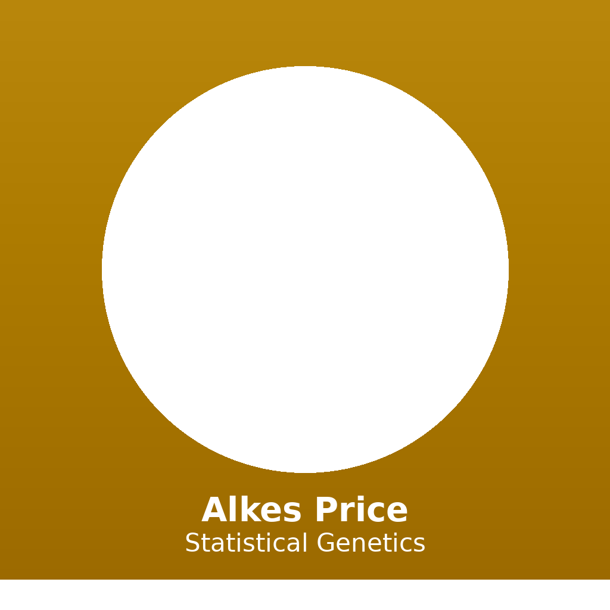

# Alkes Price

*"The question is not just whether a method works — it is whether it works for the right reasons, with well-understood assumptions and failure modes."*

---

## Quick Stats

| | |
|---|---|
| **Institution** | Harvard T.H. Chan School of Public Health |
| **Role** | Professor of Statistical Genetics |
| **Landmark Tools** | LDSC, stratified LDSC, PCA for GWAS stratification |
| **Core Insight** | LD score regression separates polygenicity from confounding; heritability is partitioned across functional categories |
| **Key Papers** | PCA for GWAS (2006), LDSC (2015), stratified LDSC (2015) |
| **Collaborators** | Nick Patterson, David Reich, Brendan Bulik-Sullivan, Hilary Finucane |

---

## Files

| File | Description |
|------|-------------|
| [`SKILL.md`](SKILL.md) | Full expert reasoning framework (9 sections) |
| [`references/01-principles.md`](references/01-principles.md) | 7 core principles |
| [`references/02-frameworks.md`](references/02-frameworks.md) | 5 conceptual frameworks (PCA, LDSC, stratified LDSC, fine-mapping, polygenic scores) |
| [`references/03-mental-models.md`](references/03-mental-models.md) | 6 mental models |
| [`references/04-heuristics.md`](references/04-heuristics.md) | 20 practical heuristics |
| [`references/05-anti-patterns.md`](references/05-anti-patterns.md) | 7 anti-patterns to avoid |
| [`references/06-quotes.md`](references/06-quotes.md) | 7 landmark quotes |
| [`references/07-sources.md`](references/07-sources.md) | 15 primary sources |

---

## 3 Landmark Papers

1. **Price AL, Patterson NJ, Plenge RM, et al. (2006).** Principal components analysis corrects for stratification in genome-wide association studies. *Nature Genetics*, 38(8):904–909. — Introduced PCA-based stratification correction; now standard practice in every GWAS.

2. **Bulik-Sullivan BK, Loh PR, Finucane HK, et al. (2015).** LD Score regression distinguishes confounding from polygenicity in genome-wide association studies. *Nature Genetics*, 47(3):291–295. — Introduced LDSC; enables heritability estimation from GWAS summary statistics.

3. **Finucane HK, Bulik-Sullivan B, Gusev A, et al. (2015).** Partitioning heritability by functional annotation using genome-wide association summary statistics. *Nature Genetics*, 47(11):1228–1235. — Introduced stratified LDSC; reveals functional architecture of complex traits.

---

[← Back to Expert Library](../../README.md)
