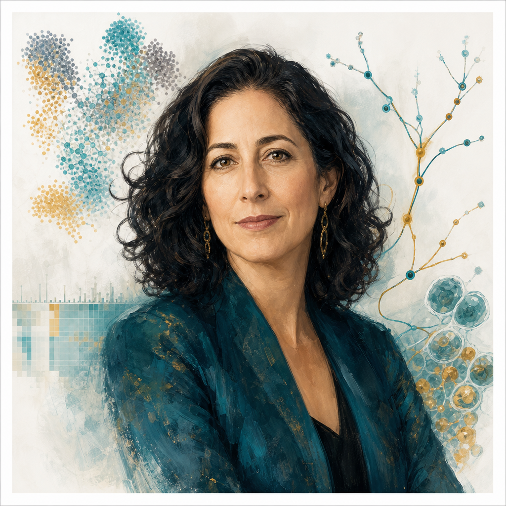

# Aviv Regev

*"The cell is the fundamental unit of life. Single-cell genomics lets us read the state of every cell — and understand how they work together."*

---

## Quick Stats

| | |
|---|---|
| **Institution** | Genentech (Roche) / MIT Broad Institute |
| **Role** | Executive VP, Research & Early Development, Genentech |
| **Prize** | HHMI Investigator; NAS Member |
| **Landmark Tool** | scRNA-seq methods · Tabula Muris · Human Cell Atlas |
| **Core Insight** | Cellular heterogeneity is not noise — it is the signal; the cell atlas is biology's periodic table |

---

## Contents

| File | Description |
|------|-------------|
| [SKILL.md](./SKILL.md) | Full expert reasoning framework — identity, 6-step protocol, principles, frameworks, heuristics, anti-patterns, quotes |
| [principles.md](./references/principles.md) | Core principles ranked by cross-source frequency |
| [frameworks.md](./references/frameworks.md) | Conceptual frameworks with associated methods |
| [mental-models.md](./references/mental-models.md) | Key mental models and metaphors |
| [heuristics.md](./references/heuristics.md) | 20 practical rules of thumb |
| [anti-patterns.md](./references/anti-patterns.md) | Failure modes to avoid |
| [quotes.md](./references/quotes.md) | Verified quotes with sources |
| [sources.md](./references/sources.md) | Primary sources used in distillation |

---

## Landmark Papers

1. **Human Cell Atlas** — Regev et al. (2017). *The Human Cell Atlas.* eLife.
2. **Tabula Muris** — Tabula Muris Consortium (2018). *Single-cell transcriptomics of 20 mouse organs creates a Tabula Muris.* Nature.
3. **Seurat** — Satija et al. (2015). *Spatial reconstruction of single-cell gene expression data.* Nature Biotechnology.

---

<a href="../README.md">← Back to all scientists</a>

