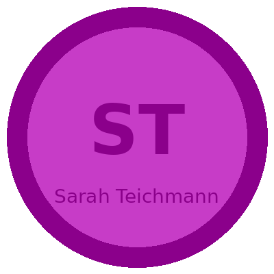

# Sarah Teichmann

### Human Cell Atlas, Single-Cell Immunology & Tissue Architecture

**Cambridge / Wellcome Sanger / GSK**

_Human Cell Atlas · Single-Cell Immunology · Spatial Transcriptomics · Protein Complexes_

**h-index:** ~100+ | **Award:** EMBO Gold Medal (2015) | **FRS:** Fellow of the Royal Society

---

## Awards & Recognition
- Fellow of the Royal Society (FRS)
- Fellow of the Academy of Medical Sciences (FMedSci)
- EMBO Gold Medal (2015)
- ISCB Fellow (2016)
- Lister Prize (2011)

---

## Landmark Papers
### Human Cell Atlas (Science, 2017)
Regev, Teichmann, et al. Science 358:eaam9868. Co-founded HCA consortium.

### Maternal-Fetal Interface (Nature, 2018)
Vento-Tormo, Efremova, ..., Teichmann. Nature 563:347-353. Novel cell types at placenta.

### Human Thymus Atlas (Nature, 2020)
Park, Brealey, ..., Teichmann. Nature 584:303-309. T cell development atlas.

---

## Files in This Package
| File | Description |
|------|-------------|
| `SKILL.md` | Full expert persona and technical framework |
| `references/01-principles.md` | Core scientific principles |
| `references/02-frameworks.md` | Analytical frameworks |
| `references/03-mental-models.md` | Mental models and reasoning patterns |
| `references/04-heuristics.md` | Rules of thumb and heuristics |
| `references/05-anti-patterns.md` | Common mistakes to avoid |
| `references/06-quotes.md` | Key quotes |
| `references/07-sources.md` | Key papers and resources |
